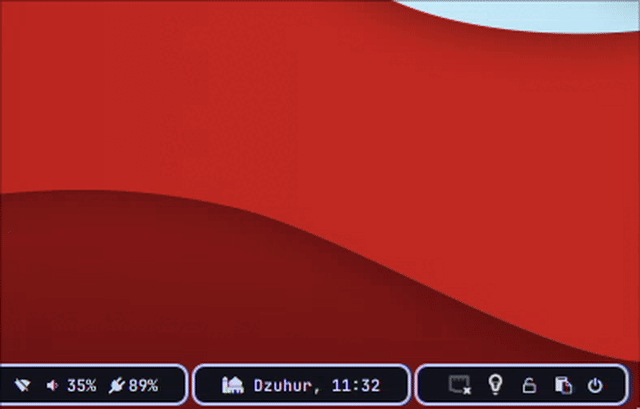

# AAI Custom Module

My custom codule Collection for Waybar.
- jadwale_waybar

	Waybar module to display prayer times for Muslims, specifically for the **Indonesia** region. The data was taken using the Islamic API from [myquran.com](myquran.com).
- ## Demo
  
- ## Features
- Show the next prayer time
- Displays today prayer time or tomorrow prayer time tooltips
- ## Requirements
  - Python 3 (Tested with 3.11.6 version)
- ## Installation
  Locate the script file you want to download, Click Raw Button, and Select Save as... and put it in your Waybar config folder. Finally add custom module entries to Waybar config (check **Example** section).

  - Link URL "jadwale_waybar.py":
    ```
    https://github.com/alizzaai/aai_waybar/blob/main/scripts/jadwale_waybar.py
    ```
- ## Usage/Examples
  
  Examples of usage in the Waybar config file **"config.jsonc"** are as follows:
  ```jsonc
  ...
  "modules-right": [...,"custom/jadwale"],
  ...
  ```
  ```
  ...
  "custom/jadwale": {
          "format": " {}",
          "tooltip": true,
          "interval": 5,
          "exec": "~/.config/waybar/scripts/jadwale_waybar.py -c banjarnegara",
          "return-type": "json"
  },
  ...
  ```
  
  The minimum "exec" command that must be used is as follows:
  ```bash
  jadwale_waybar.py -c cityname
  ```
- Optional Argument:
	- -i : selected city index (**mandatory** if multiple cities are detected)
	  Example:
	  ```jsonc
	  ...
	  "custom/jadwale": {
	          "format": " {}",
	          "tooltip": true,
	          "interval": 1,
	          "exec": "~/.config/waybar/scripts/jadwale_waybar.py -c kediri -i 1",
	          "return-type": "json"
	  }
	  ```
- ## Platform support
  Already tested on Arch Linux for now with Python 3.11.6.
- ## FAQ
- #### How to change city when i already choose it?
  
  You can change "exec" command argument "-c newcityname" in Waybar config file, delete "jadwale_waybar_output.json" file (located same as this script located) and restart Waybar to take changes.
- #### My Module working, but i can't see any icon, how to fix it?
  
  I'm using  "JetbrainsMono NF" and "Font Awesome 6 Free" font icon. You can change it as you like.
- #### I had downloaded the script to the waybar folder, why is the module not showing up?
  
  You must properly add this custom module to Waybar config (usually "config.jsonc"), like in the example section, and check the "exec" section of this module to see where this script is located.
- #### "City Not Found", how to fix it?
  
  This is because your city is not in [myquran.com](myquran.com) database. You can choose another city name that is near your city, or you can edit this script yourself as you wish. Contribution is welcome.
- #### "Multiple cities detected", how to solve this issue?
  
  This is because your city name have two or more result from database. You must add "-i *cityindex*" argument in your "exec" Waybar config section.
- #### Where is *cityindex* located?
  
  You can find what city index number you gonna choose in "jadwale_waybar_output.json", this file located same as this script located. Example: 
  ```json
  {"KAB. KEDIRI": 0, "KOTA KEDIRI": 1}
  ```
  If we choose "KOTA KEDIRI" then i put this index with "-i" argument on Waybar config.json as follows:
  ```bash
  ...
  "custom/jadwale": {
  	...
  	"exec": "~/.config/waybar/scripts/jadwale_waybar.py -c kediri -i 1",
    ...
  }
  ```
  Save the Waybar config file and restart Waybar to take changes.
- #### I can see some change in my Waybar layout, but i just see only blank space, how to fix it?
  
  Make an issue on this repository or fix it yourself. Contribution is welcome.
- ## License
  [GPL-3.0](LICENSE)